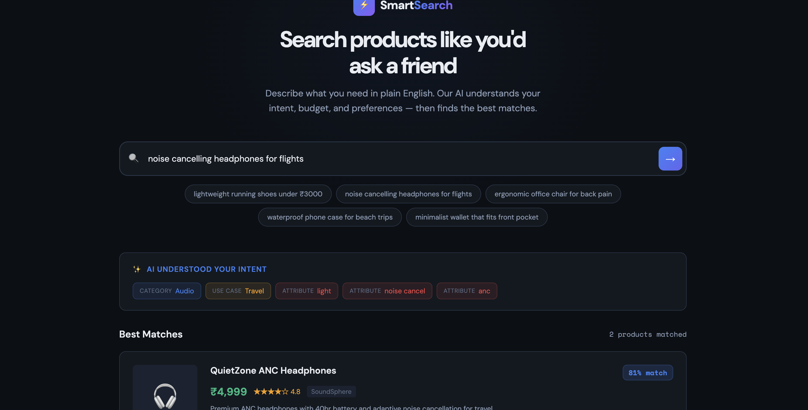

# ⚡ SmartSearch AI — Natural Language Product Discovery

> **What if e-commerce search worked like asking a knowledgeable friend?**

SmartSearch AI replaces traditional keyword + filter search with a **natural language interface** that understands what you actually need. Type a query like *"lightweight running shoes under ₹3000"* and get AI-ranked results with explanations for every match.



---

## 🎯 Why This Project?

**68% of e-commerce users abandon search** after failing to find what they need with keywords and filters (Baymard Institute). SmartSearch solves this by:

- **Understanding intent** — parses category, budget, attributes, and use-case from plain English
- **Ranking by relevance** — multi-dimensional scoring (not just keyword overlap)
- **Explaining matches** — every result tells you *why* it was recommended
- **Reducing friction** — no dropdowns, no filters, just describe what you need

---

## 📂 Repository Structure

```
smart-search-ai/
├── demo/
│   └── index.html          # Working interactive demo (open in any browser)
├── docs/
│   ├── SmartSearch_AI_PRD.docx    # Full Product Requirements Document
│   └── METRICS_FRAMEWORK.md       # Metrics & evaluation framework
├── assets/
│   └── demo-screenshot.png        # Screenshot for README
└── README.md
```

---

## 🚀 Live Demo

**No setup required.** Just open `demo/index.html` in your browser.

### Try These Queries:
| Query | What AI Understands |
|-------|-------------------|
| `lightweight running shoes under ₹3000` | Category: Footwear · Budget: ≤₹3,000 · Attribute: lightweight · Use-case: Sports |
| `noise cancelling headphones for flights` | Category: Audio · Attribute: noise cancelling · Use-case: Travel |
| `ergonomic office chair for back pain` | Category: Furniture · Attribute: ergonomic · Use-case: Health |
| `minimalist wallet that fits front pocket` | Category: Wallets · Attribute: slim, minimalist |

---

## 📋 Product Requirements Document

The [full PRD](docs/SmartSearch_AI_PRD.docx) covers:

- **Executive Summary** — Problem, solution, and value proposition
- **User Personas** — 3 detailed personas with pain points and goals
- **Feature Specification** — Intent parsing, semantic ranking, explainable AI
- **Technical Architecture** — Proposed system design (React, LLM API, Elasticsearch)
- **Rollout Plan** — Alpha → Beta → GA with success gates
- **Risks & Mitigations** — Latency, accuracy, trust, and cost risks

---

## 📊 Metrics & Evaluation Framework

The [Metrics Framework](docs/METRICS_FRAMEWORK.md) defines:

- **Search Quality Metrics** — Intent accuracy, NDCG@4, zero-result rate
- **User Experience Metrics** — CTR, time-to-click, CSAT
- **Business Impact Metrics** — Cart rate, revenue per search, retention
- **A/B Testing Design** — Control vs treatment, sample sizes, rollout gates
- **Prompt Evaluation Pipeline** — Accuracy, robustness, consistency testing
- **Dashboard Specifications** — What to build and who sees it

---

## 🛠️ Technical Approach

### How Intent Parsing Works

```
User Query: "waterproof phone case for beach trips"
                    │
                    ▼
        ┌─── AI Intent Parser ───┐
        │                        │
        │  Category: Phone Cases │
        │  Budget: none stated   │
        │  Attrs: waterproof     │
        │  Use-case: Beach/Water │
        │  Priority: Durability  │
        └────────────────────────┘
                    │
                    ▼
        ┌─── Scoring Engine ─────┐
        │                        │
        │  Category match:  30%  │
        │  Keyword match:   25%  │
        │  Attribute match: 20%  │
        │  Budget fit:      15%  │
        │  Rating bonus:    10%  │
        └────────────────────────┘
                    │
                    ▼
          Ranked Results with
          AI Match Explanations
```

### Production Architecture (Proposed)

| Layer | Technology | Purpose |
|-------|-----------|---------|
| Frontend | React / Next.js | Search UI & results |
| Intent Parser | Claude API / GPT-4 | NLP intent extraction |
| Search | Elasticsearch + vectors | Hybrid semantic search |
| Ranking | Python / scikit-learn | Multi-factor reranking |
| Database | PostgreSQL | Product catalog |
| Analytics | Mixpanel / Amplitude | Metrics & monitoring |

---

## 💡 What This Demonstrates

This project showcases AI Product Management skills:

| Skill | Evidence |
|-------|---------|
| **Product Thinking** | Identified user pain point, defined personas, wrote full PRD |
| **AI/ML Understanding** | Designed intent parsing, semantic ranking, and evaluation pipeline |
| **Metrics & Data** | Defined KPIs, A/B test design, dashboard specs, cost monitoring |
| **Technical Communication** | Architected system, documented trade-offs, created working demo |
| **Execution** | Shipped a working prototype, not just a slide deck |

---

## 🗺️ Future Roadmap

- [ ] Conversational follow-up ("Show me something cheaper")
- [ ] Multi-language support (Hindi, regional languages)
- [ ] Visual search (upload a photo to find similar products)
- [ ] Personalization using purchase history
- [ ] Integration with real product APIs (Amazon, Flipkart)

---

## 👤 About

Built as an **AI Product Manager portfolio project** demonstrating end-to-end product thinking — from problem identification to working prototype to measurement framework.

---

*Built with care. Feedback welcome via Issues or Pull Requests.*
